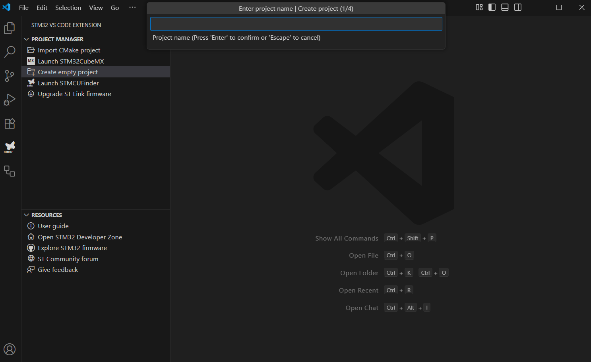
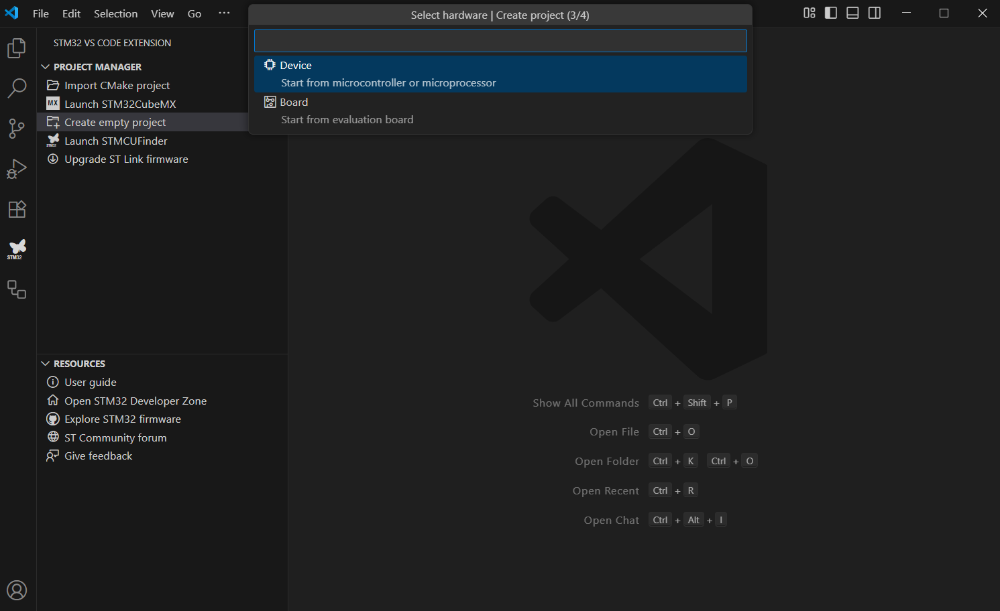
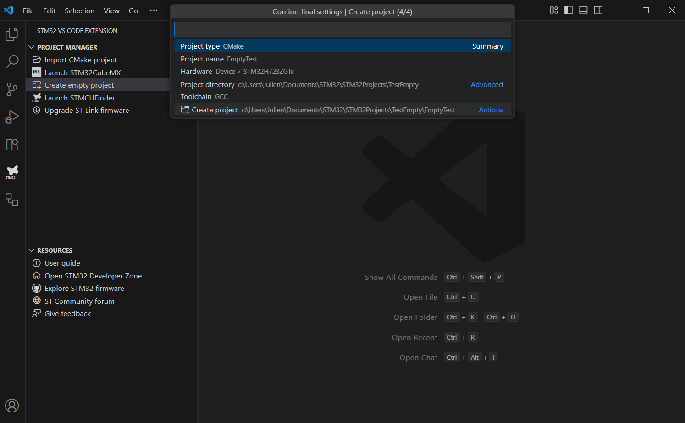
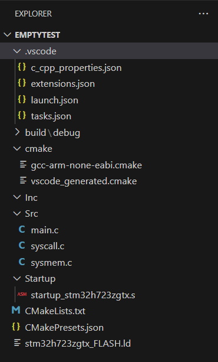

# 🚀 STM32 CMake Template: Step-by-Step Guide

This guide walks you through creating and organizing a **barebones STM32 project** using CMake and VS Code.

---

## 1️⃣ Create an Empty STM32 Project 📄

The **STM32 VS Code Extension** (by STMicroelectronics) allows you to quickly generate a minimal STM32 project for a specific board or MCU.  

### Steps:

1. Enter your project name, e.g., `STM32H7CMakeTemplate`.  
2. Select your **Device** (STM32 model). For this guide, we’ll use **STM32H723ZGTx**.  

  
  

3. Click **Create Project**. An empty project is generated:

---

### 📂 Default Project Structure

After creation, the project tree looks like this:  

| Folder/File | Purpose |
|-------------|---------|
| `.vscode/` ⚙️ | VS Code configuration files for debugging, building, and IntelliSense. |
| `build/` 🛠️ | Stores all CMake build outputs, separated by **build presets** (Debug, Release, RelWithDebInfo). |
| `CMake/` 📜 | Helper CMake scripts:  • `gcc-arm-none-eabi.cmake` → ARM GCC toolchain. • `vscode_generated.cmake` → Auto-generated project definitions (headers, sources, symbols, compiler flags). |
| `Inc/` 📑 | User **header files**. |
| `Src/` ✍️ | User **source files**. |
| `Startup/` 🏁 | Assembly startup code for the Cortex-M7 core: vector table, stack/heap setup, jump to `main()`. |

**Root Files:**

- `CMakeLists.txt` 🛠️ → Central build definition pulling helper scripts.  
- `CMakePresets.json` 🔧 → Modern CMake build presets for consistency across machines.  
- `stm32h723zgtx_FLASH.ld` 📍 → Linker script defining memory layout (Flash, RAM, stack, sections).  

---

## 2️⃣ Reorganize the Project 🗂️

To make the project **modular and consistent**, we recommend reorganizing the folder structure.

---

### 🔤 Folder Naming

Rename the default folders to **lowercase**:

| Original | New |
|----------|-----|
| `Inc` | `inc` |
| `Src` | `src` |
| `Startup` | `startup` |

---

### 📑 `inc/` → Headers

Organize headers into subfolders:  

- **`app/`** 🎯 → Application-level (abstract) headers.  
- **`hal/`** ⚡ → Hardware Abstraction Layer headers, directly related to peripherals.

---

### ✍️ `src/` → Sources

Organize sources into:

- **`app/`** 🎯 → Application-level source files.  
- **`hal/`** ⚡ → Hardware/peripheral-dependent source files.  
- **`system/`** 🖥️ → System-level files (e.g., `system_syscall.c`, `system_sysmem.c`).  

**Naming Convention:** Prefix each file with its folder name for clarity:  

app_main.c, hal_uart.c, system_syscall.c

---

### 🏁 `startup/` → Startup & Linker

- Keep the **startup assembly file** (e.g., `startup_stm32h723zgtx.s`).  
- Move the **linker script** (`stm32h723zgtx_FLASH.ld`) here, since it is closely tied to memory initialization.  

---

✅ **Benefits of this Reorganization:**

- Clear separation between **application, hardware, and system code**.  
- Consistent **naming convention** (lowercase, prefixed files).  
- Easier navigation and maintenance for multiple developers.  

---

## 3️⃣ Add Submodules

Empty projects do **not include HAL or CMSIS** by default. Git submodules are the recommended way to manage these dependencies.  

### 📂 Submodules Folder

Create a `submodules` folder at the project root and add the required repositories.  

---

### 🔧 Required Submodules

| Submodule | Purpose |
|-----------|---------|
| **CMSIS** | ARM project handling CPU registers and peripherals. |
| **cmsis-device-h7** | Adds CMSIS support for STM32H7 series. |
| **stm32h7xx-hal-driver** | HAL and LL drivers for STM32H7. |

---

### 📝 Notes

- Adding submodules automatically generates a `.gitmodules` file at the root.  
- Submodules ensure **consistent versions** across different machines and projects.  
